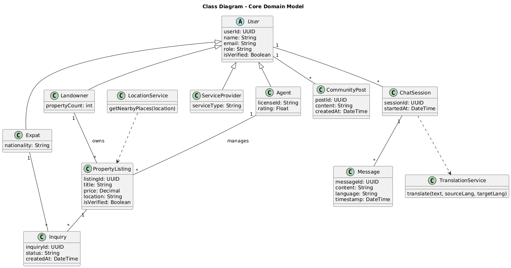

# ExpatHomes – Expat Support & Settlement Platform (Rwanda)

ExpatHomes is a mobile-first expat support platform designed to improve the experience of expats, international students, and foreign professionals relocating to Rwanda. The platform focuses on trust, communication, and verified services, addressing common challenges such as housing exploitation, language barriers, arrival logistics, and access to essential local services.

Rather than replacing existing service providers, ExpatHomes acts as a **connection hub**, integrating verified housing listings, real-time multilingual communication, location-based discovery, and trusted transport cost transparency into a single cohesive experience.

---

## Project Description

Relocating to a new country can be overwhelming, particularly for first-time arrivals. Expats often face:
- Unverified housing agents and opaque pricing
- Communication barriers with landlords and service providers
- Difficulty navigating unfamiliar locations
- Fragmented arrival and onboarding experiences
- Limited access to trusted community guidance

ExpatHomes addresses these issues by prioritising:
- **Verified housing listings**
- **Direct, secure communication**
- **Role-based access control**
- **Lightweight integrations with trusted external services**
- **Community-driven knowledge sharing**

---

## Designs

### Figma Mockups

Design Link: *https://www.figma.com/design/ZzcXrh5VLp93Em9U8tpXK4/Expat?node-id=455-3067&t=Q0yACGkum3N2qMm0-1*

The interactive design prototype demonstrates the full system behaviour and user flows, including:

- Community feed and topic-based groups (Bowls)
- Verified estate listings with inquiry-driven interaction
- Secure messaging with live translation
- Arrival support through transport cost estimation
- Location-based discovery via Google Maps
- Role-based interfaces for expats and agents/landlords

The designs are mobile-first and intentionally minimalist, prioritising clarity, trust, and communication over transactional complexity.

---

## System Diagrams

The following diagrams guide the design and implementation of the system:

### 1. System Architecture Diagram
The system architecture illustrates how ExpatHomes is structured as a mobile-first platform backed by Firebase services and external APIs. The mobile application serves as the primary interface for all users (Expats, Agents/Landlords, and Service Providers), while Firebase handles backend responsibilities such as authentication, data storage, and real-time communication. External services such as Google Maps and partner transport providers (e.g., Move) are integrated to support location discovery and ride cost estimation without replicating existing third-party solutions.

  

### 2. Entity Relationship Diagram (ERD)
The ERD provides a database-level view of how data is structured and related within Firestore. It focuses on persistence concerns such as ownership, foreign-key–like references, and cardinality between users, listings, inquiries, chats, and messages. The ERD ensures data consistency, scalability, and clarity in how information flows through the system.

  

### 3. UML Use Case 
The use case diagram captures how different actors interact with the system and clarifies role-based access across the platform. Expats are the primary users, engaging with listings, community features, messaging, exploration tools, and arrival support. Agents and landlords focus on managing listings and communicating with expats, while administrators oversee verification and moderation. This diagram ensures functional boundaries are clearly defined and aligned with trust and transparency goals.

  

### 4. UML Class Diagram
The class diagram represents the core domain entities of ExpatHomes and their relationships. Central to the model is the `User` entity, which is extended through roles such as Expat, Agent, and Landlord. Supporting entities include Property Listings, Inquiries, Chat Sessions, Messages, and Community Posts. This diagram informed both the Firestore data structure and the UI component logic within the mobile application.

  

---

## Deployment Plan

At this stage, ExpatHomes focuses on design, prototyping, and system modelling rather than full production deployment.

### Planned Architecture
- **Frontend:** Flutter (Android / iOS)
- **Backend:** Firebase
  - Firebase Authentication (role-based access)
  - Cloud Firestore (real-time data storage)
  - Firebase Storage (media uploads)
- **External Services:**
  - Google Maps & Places API (Explore feature)
  - Transport partner API (ride cost estimation)

Production deployment and advanced backend logic are planned as future work beyond the capstone timeline.

---

## Video Demo

🎥 **Video Demo:** *https://drive.google.com/drive/folders/1YhtUzBrgGVvE0uT6gy-Anae2fN02YtvV?usp=sharing*

The demo showcases:
- Project motivation and problem context
- Community feature and Bowl-based interaction
- Verified estate listings and inquiry flow
- Secure messaging with live translation
- Explore feature using location-based discovery
- Rides feature for arrival cost transparency
- Role-based access behaviour

---

## Current Project Phase

- ✅ Problem analysis and system requirements
- ✅ UX/UI design and interactive prototyping
- ✅ UML and system architecture modelling
- 🔄 Firebase-backed implementation (planned / in progress)
- 🔄 External API integrations

---

## Key Technologies

### Design & Prototyping
- Figma

### Frontend
- Flutter (mobile-first development)

### Backend & Infrastructure
- Firebase Authentication
- Cloud Firestore
- Firebase Storage

### External APIs
- Google Maps & Places API
- Transport partner API (fare estimation only)

---

## Author

**Somtochukwu Nelson**  
**Email:** m.nelson@alustudent.com
**Supervisor:** Pelin Mutanguha
Project: ExpatHomes
