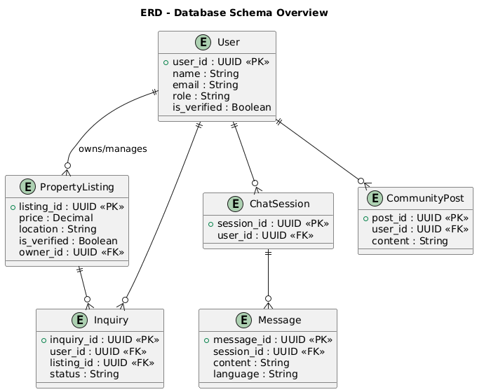
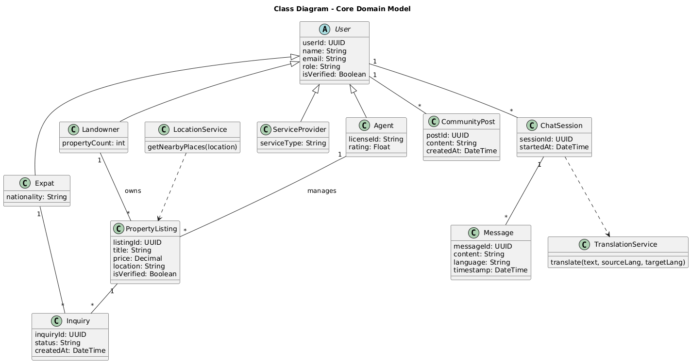

# ExpatHomes

**ExpatHomes** is a mobile-first platform that helps expatriates, students, and professionals settle in Rwanda—starting with **trusted housing discovery**, **community**, **in-app messaging**, and **location-aware tools** (rides and neighbourhood exploration). The product is built around **Firebase** for auth and data, **Google Maps Platform** for maps and places, and a separate **admin web** app for operational access.

---

## What’s implemented today

### Mobile app (`expat_app/`)

- **Authentication & profiles** — Email/password and Google sign-in paths, Firestore-backed user profiles with roles (**Expat**, **Landlord**, **Agent**, **Super Admin**).
- **Onboarding** — Get Started, sign-in/up flows, language preference, profile setup.
- **Splash** — Branded intro animation; native launch screens aligned with app colours (`#1A2E35` / `#8ED966`).
- **Expat home**
  - **Community** — Feed and **Bowls** (groups), post composer with media, likes/comments, threads.
  - **Rides** — Google Map with **From / To** (Places autocomplete, geocoding), **Directions** polylines, estimated **distance/duration**, **RWF fare estimate** (configurable per-km helper), listing **“Get a Ride”** pre-fills destination from estate or listing detail.
  - **Estates** — Published listings from Firestore (filter by type, search), cards with **Get a Ride** and **Explore Area** (hands listing location into Explore).
  - **Messages** — Conversations tied to listings; **ML Kit** on-device language ID and translation in the composer; attachment-friendly flows where wired.
  - **Explore** — Search anchor via Places; **Nearby Search** by category (**Food**, **Health**, **Fitness**, **Shopping**); place cards (photos, address, rating, hours); **Continue in Google** (opens place in Google Maps); **session restore** (~24h) via `shared_preferences`; full-screen results UI with shell chrome hidden; back returns to map **with search text preserved**.
- **Listing detail** — Deep link from feed/estates; landlord chat; ride/explore actions return structured navigation payloads.
- **Landlord & Agent** — Dedicated Flutter entry screens for listing management, payments UI, assignments, and messaging (workflows continue to evolve—see *Future work*).
- **Super Admin (mobile)** — Currently routes to the expat shell as a placeholder; operational admin is intended for **`admin-web`**.

### Backend & config

- **Firebase** — `firebase_core`, `firebase_auth`, `cloud_firestore`, `firebase_storage`.
- **Security rules** — `firestore.rules` in repo (adjust per environment).
- **Google Maps / Places / Directions / Geocoding** — Used from the Flutter app (HTTP + Android Maps SDK). API key configuration is documented under `docs/GOOGLE_MAPS_SETUP.md`.
- **Local secrets** — Prefer `expat_app/env/google_maps.properties` (gitignored); see `expat_app/env/google_maps.example.properties`. Gradle still accepts `android/local.properties` or `GOOGLE_MAPS_API_KEY` env var.

### Admin web (`admin-web/`)

- React-based **superadmin** panel, hosted on Firebase. Source lives in `admin-web/`; day-to-day access is via the link below.

---

## Repository layout

| Path | Purpose |
|------|--------|
| `expat_app/` | Flutter application (primary product) |
| `admin-web/` | Web console for administrators |
| `docs/` | Setup notes (e.g. Google Maps) |
| `firestore.rules` | Firestore security rules |
| `png_directory/` | Design and diagram assets referenced below |

---

## Prerequisites

- **Flutter** SDK (Dart ^3.7 per `pubspec.yaml`)
- **Node.js** & npm (optional — only if you run `admin-web` locally)
- **Firebase** project with Android (and optionally iOS) apps registered
- **Google Cloud** project with billing and APIs enabled for Maps, Places, Directions, and Geocoding (see `docs/GOOGLE_MAPS_SETUP.md`)

---

## Run the Flutter app

```bash
cd expat_app
flutter pub get
```

1. Copy `env/google_maps.example.properties` → `env/google_maps.properties` and set `GOOGLE_MAPS_API_KEY`.
2. Ensure Firebase config files are in place (`google-services.json` for Android, etc.).
3. Run:

```bash
flutter run
```

After changing the Maps key or Gradle env sources, use `flutter clean` before the next release build.

---

## Admin web (hosted)

**URL:** [https://expat-homes-28b62.web.app](https://expat-homes-28b62.web.app)

**Test login**

| Field | Value |
|--------|--------|
| Email | `admin@expathomes.rw` |
| Password | `admin123` |

---

## Testing & QA

- **Automated tests:** From `expat_app/`, run `flutter test`. With coverage: `flutter test --coverage`.
- **Chart-ready metrics:** From the repo root, run `.\scripts\collect-test-metrics.ps1` (PowerShell). This runs the full suite, writes JSON line events, and produces **`docs/qa/generated/test_metrics.json`** and **`test_metrics.csv`** (ignored by git) for pass/fail totals, per-suite counts, duration, and a coarse **line coverage %** from `lcov.info`. See **`docs/qa/README.md`** for schema details.
- **Manual regression:** Use **`docs/QA_CHECKLIST.md`** for role-based smoke checks (Community, Estates, Rides, Explore, Messages, maps keys, Firebase).

---

## Design & architecture references

### Figma mockups

**Design link:** [ExpatHomes on Figma](https://www.figma.com/design/ZzcXrh5VLp93Em9U8tpXK4/Expat?node-id=455-3067&t=Q0yACGkum3N2qMm0-1)

The interactive prototype illustrates community and bowls, verified estates, messaging (with translation), rides and explore, and role-specific landlord/agent flows. The visuals below are exported references stored in `png_directory/figma_mockups/`.

<div align="center">


</div>

### System diagrams

High-level modelling assets live under `png_directory/sys_dir/` and complement the implementation described above.

#### 1. System architecture

<div align="center">


</div>

#### 2. Entity relationship diagram (ERD)

<div align="center">



</div>

#### 3. UML use case

<div align="center">


</div>

#### 4. UML class diagram

<div align="center">



</div>

---

## Product collateral

- **Solution folder (Google Drive):** [Product solution materials](https://drive.google.com/drive/u/0/folders/1_AMhxyJX8jGhNmvqjKVwZOvtTcxecxAB)
- **Video demo:** [Demo folder](https://drive.google.com/drive/folders/1YhtUzBrgGVvE0uT6gy-Anae2fN02YtvV?usp=sharing)

---

## Future implementations

These items extend the current foundation into a full production-grade marketplace and operations stack.

1. **Landlord, admin, and agent workflows** — End-to-end flows: listing lifecycle (draft → review → publish), edit requests, commission and payout reconciliation, bulk tools, and admin moderation dashboards beyond the current web/mobile split.
2. **AI-assisted listing assignment** — Models that suggest or auto-route new listings to suitable licensed agents (constraints: geography, capacity, language, specialization), with human override and audit logs.
3. **Security hardening** — Stricter Firestore rules per subcollection, rate limiting, anomaly detection, secrets rotation runbooks, optional **separate REST-only Maps key** vs Android-restricted SDK key, penetration testing, and dependency/CVE monitoring.
4. **Agent vetting, ratings, and reviews** — Document verification pipeline, expiry reminders, public agent profiles with aggregated ratings, listing-specific reviews, and dispute handling.
5. **Notifications & engagement** — Push (FCM), email for critical events, and digest preferences.
6. **Payments** — Integration with regulated payment providers; escrow or milestone flows where legally viable; receipts and landlord/agent statements.
7. **iOS parity & release** — Maps SDK for iOS, TestFlight/App Store pipeline, entitlements and privacy manifests.
8. **Quality & operations** — Automated tests (unit/widget/integration), CI/CD, crash reporting, and performance budgets for maps and chat.
9. **Accessibility & i18n** — WCAG-minded UI, screen-reader labels, and broader locale coverage beyond current translation helpers.
10. **Analytics & trust metrics** — Funnel analytics, conversion on inquiries, and transparency reports for stakeholders.

---

## Key technologies

| Layer | Stack |
|--------|--------|
| Mobile | Flutter, `google_maps_flutter`, `geolocator`, `url_launcher`, `shared_preferences`, `http` |
| Auth & data | Firebase Auth, Cloud Firestore, Firebase Storage |
| ML (on-device) | Google ML Kit (translation, language ID) |
| Maps | Maps SDK for Android, Places API, Directions API, Geocoding API, Place Photos |
| Admin UI | React (`admin-web`) |

---

## Current project phase

- Problem analysis, UX/UI design, and system modelling — **complete**
- Firebase-backed mobile implementation (core Expat flows, maps, messaging, explore) — **in active use**
- Landlord / agent / superadmin depth — **partial**; aligned with *Future implementations*
- Production hardening, AI assignment, and full vetting/ratings — **planned**

---

## Author

**Somtochukwu Nelson**  
**Email:** m.nelson@alustudent.com  
**Supervisor:** Pelin Mutanguha  
**Project:** ExpatHomes
